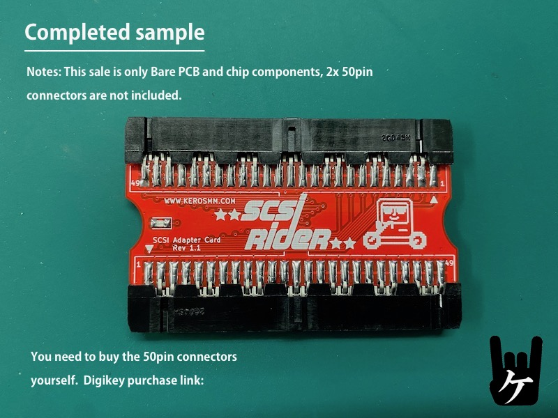

 
　
# What kind of product is this
This is an adapter for connecting SCSI devices like BlueSCSI to the internal SCSI 50pin connector.
Especially designed for Mac SE/30, SE...
 
  This card is made for
*[BlueSCSI](https://github.com/erichelgeson/BlueSCSI)*
 
  
 
More details here (My Blog):
  https://ameblo.jp/keroxiee1016/entry-12782849654.html

## Assemble

Check out the [assembly instructions](Assembly/README.md) when you're ready to get started.

## Supported Macs

 
*SCSI RIDER with Classic2
  
Macintosh SE, SE/30, Classic, Classic2 *It may work for IIcx and IIci, but it has not been verified yet.

## Gerber files

You can use it by compressing [ER_R1.2_GERBER](ER_R1.2_GERBER)  and uploading it to JLCPCB as it is.

## License

This work is licensed under a
[Creative Commons Attribution-ShareAlike 4.0 International License](https://creativecommons.org/licenses/by-nc-sa/4.0/).
